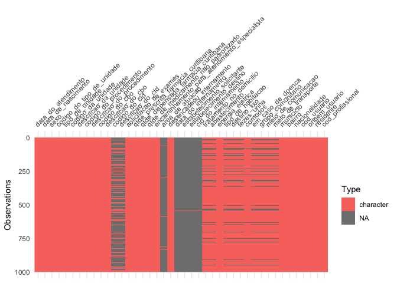
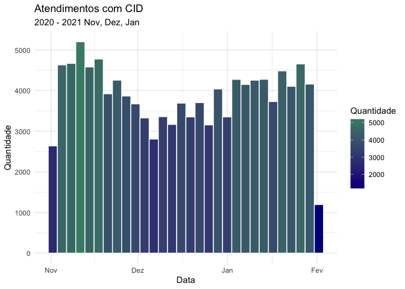
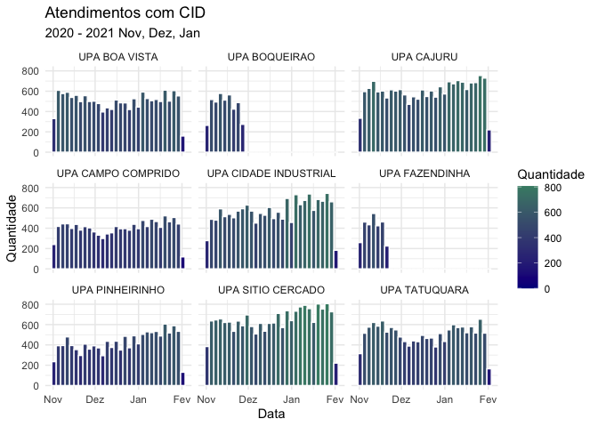
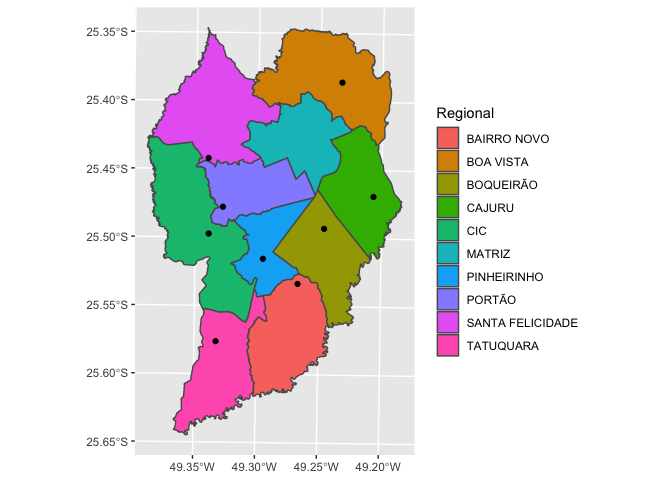
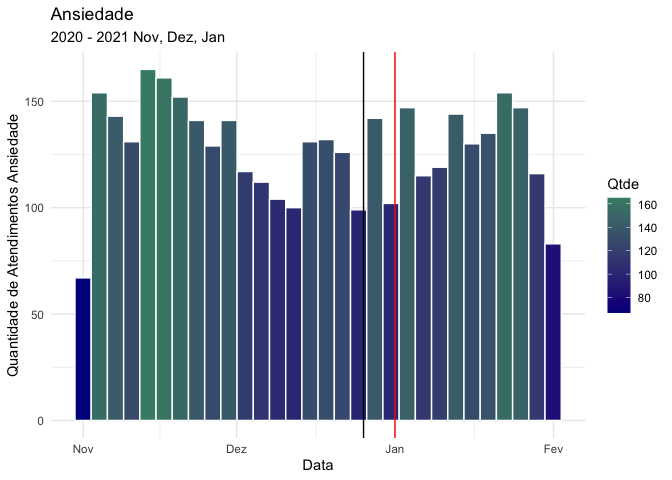
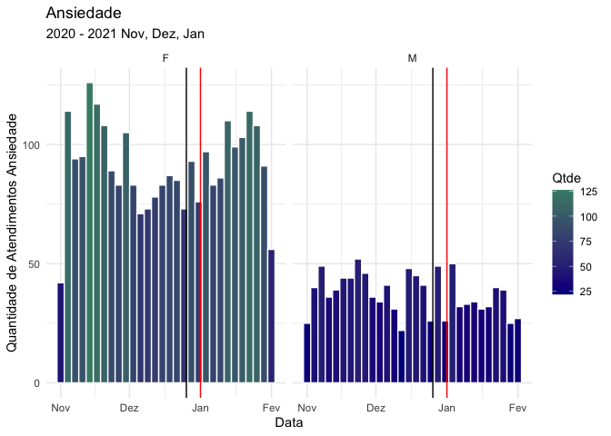

Exercício feito para o Dia dos Dados Abertos 2021 em Curitiba
================

Este exercício foi montado para o [Dia dos Dados Abertos de 2021 em
Curitiba](https://dadosabertos.curitiba.org) (OpenDataDay2021).

## Dados Abertos - Prefeitura de Curitiba

A prefeitura de Curitiba possui este
[site](https://www.curitiba.pr.gov.br/dadosabertos/) para disponibilizar
dados da administração municipal.


Escolhi o arquivo com dados dos atendimentos de enfermagem para
avaliarmos.

``` r
saude <- readr::read_delim(
  file = "./2021-02-06_Sistema_E-Saude_Enfermagem_-_Base_de_Dados.csv",
  delim = ";",
  col_types = cols(.default = "c")
)

saude <- janitor::clean_names(saude)
```

A função *janitor::clean\_names* faz a troca de nomes como `Área de
Atuação` para *area\_de\_atuacao* (isto ajuda muito na hora de
digitar).

A função skimr::skim() mostra um resumo dos dados. Por exemplo, vemos
que boa parte dos registros não possuem disponível o campo
*codigo\_do\_cid*. Para esta análise, vamos eliminar os registros sem
estas informações, e diminuir as colunas apenas para um sub-grupo das
colunas iniciais.

Eu gosto de utilizar o pacote *visdat* e *skimr* nas primeiras análises
sobre dados, porque eles fornecem visões gerais úteis.

``` r
saude %>% dplyr::sample_n(1000) %>% visdat::vis_dat()
```

<!-- -->

O gáfico mostra que há muitos registros de atendimento sem código do
CID. Vamos restringir nossa análise apenas àqueles com esta informaçao.

``` r
total_registros <- saude %>% nrow()
registros_com_cid <- saude %>% 
  dplyr::filter(
    !is.na(descricao_do_cid)
  ) %>% 
  nrow()
```

São 537322, mas apenas 115493 registros com CID.

Antes de seguir, vamos filtrar os dados e manter apenas os com CID.

``` r
saude <- saude %>% 
  dplyr::filter(
    !is.na(descricao_do_cid)
  )
```

## Registros dos últimos 3 meses.

O site da prefeitura indica que os registros são atualizados apenas para
os últimos 3 meses.

Vamos montar um histograma para verificar como estes atendimentos
aconteceram no tempo.

``` r
saude <- saude %>% 
  dplyr::mutate(
    data_do_atendimento = lubridate::dmy_hms(data_do_atendimento)
  )

(
hist_saude <- saude %>% 
  ggplot() +
  geom_histogram(aes(x = data_do_atendimento, 
                     fill = ..count..),
                 color = "white") +
    scale_fill_gradient(
      "Quantidade",
      low = "darkblue",
      high = "aquamarine4"
    ) +
    labs(title = "Atendimentos com CID",
         subtitle = "2020 - 2021 Nov, Dez, Jan",
         x = "Data",
         y = "Quantidade"
    ) + 
    theme_minimal()
)
```

    ## `stat_bin()` using `bins = 30`. Pick better value with `binwidth`.

<!-- -->

Olhando nos gráficos disponibilizados, percebemos que há um campo para
identificar o local do atendimento: *descricao\_da\_unidade*. Vamos
verificar se há diferença de comportamento dos dados conforme o local.

``` r
(hist_saude + facet_wrap(~ descricao_da_unidade))
```

    ## `stat_bin()` using `bins = 30`. Pick better value with `binwidth`.

<!-- -->

# Mapas são legais

Como seria possível colocar isto em um mapa?

Primeiro precisamos de um mapa… e o IPPUC possui vários shapefiles neste
[site](https://ippuc.org.br/geodownloads/geo.htm).


``` r
regionais <- sf::read_sf(
  dsn = "./DIVISA_DE_REGIONAIS_SIRGAS/",
  layer = "DIVISA_DE_REGIONAIS"
)

upas <- sf::read_sf(
  dsn = "./UNIDADE_DE_PRONTO_ATENDIMENTO_SIRGAS",
  layer = "UNIDADE_DE_PRONTO_ATENDIMENTO"
)

(
  ggplot() +
    geom_sf(data = regionais,
            mapping = aes(geometry = geometry, fill = NOME)) +
    labs(fill = "Regional") +
    geom_sf(data = upas, 
            mapping = aes(geometry = geometry))
)
```

<!-- -->

Qual é o total de atendimentos por UPA?

``` r
(por_upa <- saude %>% 
  count(descricao_da_unidade, sort = T))
```

    ## # A tibble: 9 x 2
    ##   descricao_da_unidade      n
    ##   <chr>                 <int>
    ## 1 UPA SITIO CERCADO     19125
    ## 2 UPA CAJURU            17890
    ## 3 UPA CIDADE INDUSTRIAL 16856
    ## 4 UPA TATUQUARA         15061
    ## 5 UPA BOA VISTA         14947
    ## 6 UPA PINHEIRINHO       12676
    ## 7 UPA CAMPO COMPRIDO    12011
    ## 8 UPA BOQUEIRAO          4117
    ## 9 UPA FAZENDINHA         2810

``` r
por_upa <- por_upa %>% 
  mutate(
    descricao_da_unidade = stringr::str_remove(descricao_da_unidade, "UPA "),
    descricao_da_unidade = case_when(
      descricao_da_unidade == "PORTAO" ~ "PORTÃO",
      descricao_da_unidade == "BOQUEIRAO" ~ "BOQUEIRÃO",
      TRUE ~ descricao_da_unidade))
```

Vamos tentar um mapa dos atendimentos por bairro. Não basta o número de
atendimentos, é preciso considerar a população da regional.

As informações sobre a população no site do IPPUC são de 2010. As
estimativas no site do IBGE não detalham as regionais. A melhor
estimativa que encontrei foi de 2016 publicada em uma imagem em matéria
no [site da
Prefeitura](https://www.curitiba.pr.gov.br/noticias/populacao-das-regionais-de-curitiba-supera-a-da-maioria-das-cidades-do-parana/41159).

Vamos seguir com estes números.

``` r
pop <- tibble::tibble(
  regional = c(
    "BOA VISTA",
    "CAJURU",
    "MATRIZ",
    "BOQUEIRÃO",
    "CIDADE INDUSTRIAL",
    "PORTÃO",
    "SANTA FELICIDADE",
    "BAIRRO NOVO",
    "PINHEIRINHO",
    "TATUQUARA"
  ),
  pop_est_2016 = c(
    268556,
    232563,
    208674,
    205248,
    200271,
    184437,
    155525,
    163651,
    151202,
    112873
  )
)
```

Vamos achar a relação de atendimentos por população para as regionais.

``` r
por_upa <- por_upa %>% 
  left_join(
    pop,
    by = c("descricao_da_unidade" = "regional")) %>% 
  mutate(
    atend_por_khabit = n * 1000 / pop_est_2016
  )

regionais <- regionais %>% dplyr::left_join(
  por_upa,
  by = c("NOME" = "descricao_da_unidade")
)

(
  ggplot() + 
    geom_sf(data = regionais, mapping = aes(geometry = geometry, fill = atend_por_khabit)) +
    labs(fill = "Atendimentos por 1000 habitantes") +
    geom_sf(data = upas, mapping = aes(geometry = geometry))
)
```

<!-- -->

# Quais são as principais causas de atendimentos?

``` r
saude %>% count(descricao_do_cid, sort = TRUE)
```

    ## # A tibble: 2,658 x 2
    ##    descricao_do_cid                                                            n
    ##    <chr>                                                                   <int>
    ##  1 DOR LOMBAR BAIXA                                                         5882
    ##  2 DIARREIA E GASTROENTERITE DE ORIGEM INFECCIOSA PRESUMIVEL                4578
    ##  3 PROCEDIMENTO NAO REALIZADO DEVIDO A DECISAO DO PACIENTE POR OUTRAS RAZ…  4415
    ##  4 CEFALEIA                                                                 3965
    ##  5 DOR AGUDA                                                                3620
    ##  6 ANSIEDADE GENERALIZADA                                                   3367
    ##  7 OUTRAS DORES ABDOMINAIS E AS NAO ESPECIFICADAS                           3341
    ##  8 EXAME MEDICO GERAL                                                       3110
    ##  9 INFECCAO DO TRATO URINARIO DE LOCALIZACAO NAO ESPECIFICADA               3038
    ## 10 NAUSEA E VOMITOS                                                         2726
    ## # … with 2,648 more rows

## Ansiedade e doenças relacionadas

``` r
psi <- saude %>% filter(codigo_do_cid %in% c("F410", "F411", "F419"))

(psi %>% count(descricao_do_cid, sort = TRUE))
```

    ## # A tibble: 3 x 2
    ##   descricao_do_cid                                           n
    ##   <chr>                                                  <int>
    ## 1 ANSIEDADE GENERALIZADA                                  3367
    ## 2 TRANSTORNO ANSIOSO NAO ESPECIFICADO                      246
    ## 3 TRANSTORNO DE PANICO [ANSIEDADE PAROXISTICA EPISODICA]   226

``` r
(hist_psi <- psi %>% ggplot() +
  geom_histogram(aes(x = data_do_atendimento,
                     fill = ..count..),
                 color = "white") +
  scale_fill_gradient("Qtde",
                      low = "darkblue",
                      high = "aquamarine4") +
  labs(title = "Ansiedade",
       subtitle = "2020 - 2021 Nov, Dez, Jan",
       x = "Data",
       y = "Quantidade de Atendimentos Ansiedade") +
  theme_minimal() +
  geom_vline(xintercept = dmy_hms("25/12/2020 20:00:00")) +
  geom_vline(xintercept = dmy_hms("31/12/2020 23:30:00"), color = "red")
)
```

    ## `stat_bin()` using `bins = 30`. Pick better value with `binwidth`.

<!-- -->

``` r
(hist_psi + facet_wrap(~ sexo))
```

    ## `stat_bin()` using `bins = 30`. Pick better value with `binwidth`.

<!-- -->
